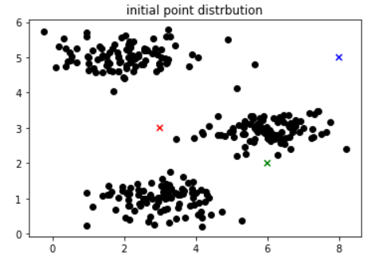
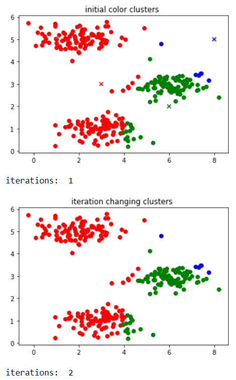
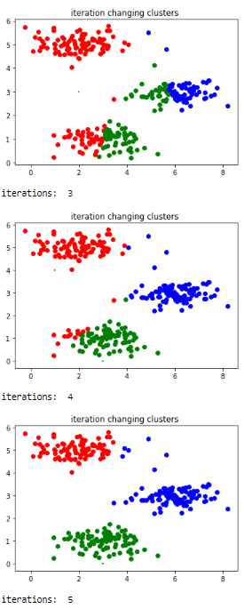
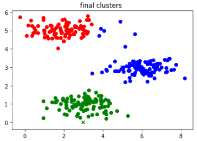

# K-means
Simplest and popular unsupervised machine learning algorithms.
# What is the K-means Algorithm
It is a unsupervised machine learning algorithm where the goal is to group data together for a k-numberbed of clusters. 

# How does it work 
you will create set k number of random placed points in you data. That will become you cluster centriods.
For my project the number of clusters, K = 3. The initia centriods are ideally random, but they are [3,3],[6,2],[8,5].

# Step One
The initial point distribution should be depicted in the 2-D space, alongside 3
initial centroid points. The centriod should be in 3 different colors and specific
markers indicating they are centroids and not points. The dataset points should
be in any 4 th color. So essentially 3 markers and 4 colors in total.  

